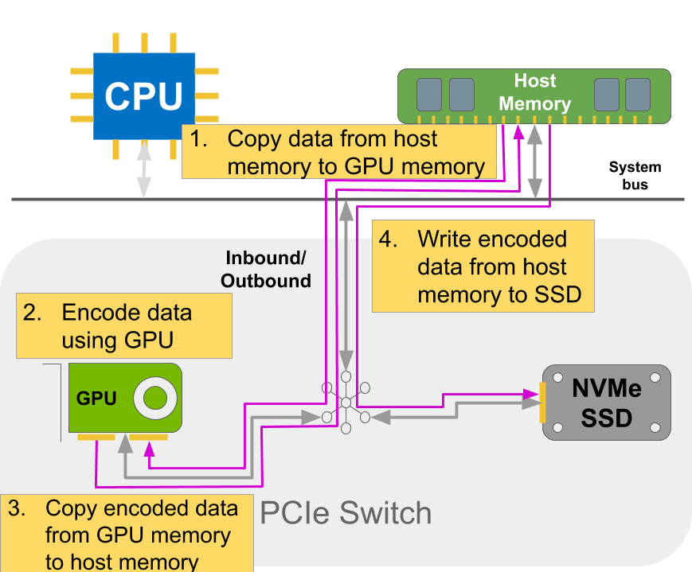
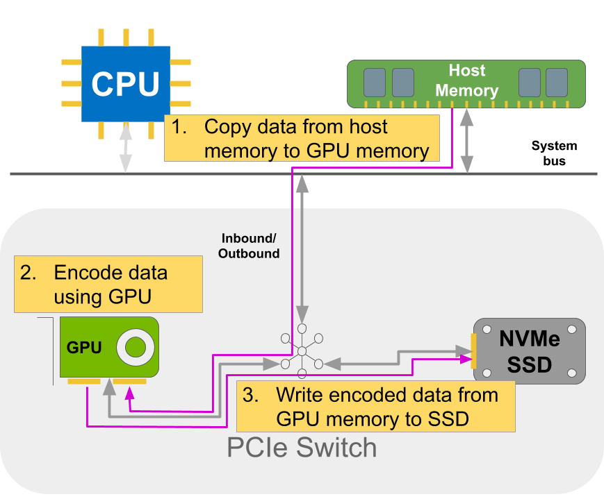
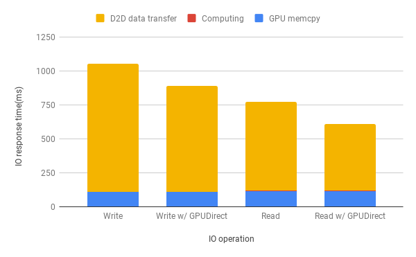

# ECS2 Introduction
Light GPU Erasure coded storage system without main memory as bounce buffer.

## Features
* Minimize GPU and SSD data transfer latency without involving main memory as bounce buffer.
* Provides user-space library api.
* Supports parallel IO to NVMe SSD.

## ECS2
* To encode data using GPU, data needs to go through host memory as bounce buffer.

* With ECS2, data can directly write from GPU to SSD.


## Performance
* Latency reduction from ECS2
    * Read improvement: 17% 
    * Write improvement: 8%


* Environment
    * CPU: Intel(R)Xeon(R) Gold 6150 CPU @ 2.70GHz
    * GPU: NVIDIA Tesla V100
    * Memory: 126GB 8-channel DDR4memory clocked at 2666 MHz
    * SSD: Intel P4500 2TB SSD

* Testcase
    * Data size: 1GiB

## Publication
* Accepted by CLUSTER2020. Link will be available later.

## Prerequisite & Limitation
* Modified [libgibraltar](https://github.com/jaredjennings/libgibraltar), a GPU erasure code library. 
    * Apply ```libgibraltar.patch``` to libgibraltar, and setup libgibraltar environment variable
* gdrcopy+, a modified version of [gdrcopy](https://github.com/NVIDIA/gdrcopy)

### Environment Variable Setup
* libgibraltar
    * GIB_SRC_DIR, $HOME/libgibraltar/src
    * GIB_CACHE_DIR, $HOME/libgibraltar/ptx

### gdrcopy+
#### Run-Time Requirements
* NVIDIA Tesla or Quadro GPU
* NVIDIA display driver version 375.26
* Ubuntu 16.04 x86_64, or compatible kernel (version 4.4.0)
* XFS or EXT4 file system
* Over 300MB host memory will be consumed additionally for every 16GB GPU
memory; up to 5GB host memory will be consumed additionally for 16 16GB
GPUs.
* Root priviledges

#### Compile-Time Requirements
* The CUDA Toolkit 8.0 or higher
* The NVIDIA display driver source tree
* The kernel header files

#### Install kernel modules
##### Source Code Installation
1. Copy the NVIDIA display driver source tree to the user’s home directory.
    1. ``` cd ~ ```
    1. ```cp -R /usr/src/nvidia-* .```
2. Create a symbolic link to ```~/gdrcopy+/gdrdrv``` under the NVIDIA display driver
source tree.
    1. ```cd nvidia-*```
    1. ```ln -s ~/gdrcopy+/gdrdrv```
##### Building the Kernel Modules
1. You will need some of symbols from the NVIDIA display driver. So, you have to build
the NVIDIA display driver first.
    1. ```cd ~/nvidia-*```
    2. ```make module```
1. Now, you are ready to build the kernel modules.
    1. ```cd ~/nvidia-*```
    2. ```make NV_KERNEL_MODULES=gdrdrv```
1. You will need root priviledges to load the kernel modules.
    1. ```cd ~/gdrcopy+```
    2. ```./insmod.sh```
 
##### Building the erasure Sample Program
1. ```cd ~/gdrcopy+```
2. ```make example```

##### Run sample program #####
1. Create file named "ecs2file" in ECS2. The file header will be in <ECS2_FILE_HEADER_PATH>
    1. ```sudo ./example -c <ECS2_FILE_HEADER_PATH> -d 0 -C ecs2file -m 4 -k 2```
    * -c, path for config (ECS2 file header) file.
    * -d, device number (which GPU to use)
    * -C, to create in ECS2, specifying the file name in ECS2
    * -m, erasure configuration, partition original data into m blocks
    * -k, erasure configuration, generate additional k blocks.
2. Write file to "ecs2file" in ECS2.
    1. ```./example -c /home/ron/home/jerrychou/GE/ -d 0 -f /home/ron/home/jerrychou/input -W ecs2file```
    * -c, path for config (ECS2 file header) file.
    * -d, device number (which GPU to use)
    * -f, file name of the file to be written into ECS2.
    * -W, to write into ECS2. specifying the file name in ECS2
3. Read file from "ecs2file" in ECS2.
    1. ```./example -c /home/ron/home/jerrychou/GE/ -d 0 -f /home/ron/home/jerrychou/output -R ecs2file```
    * -c, path for config (ECS2 file header) file.
    * -d, device number (which GPU to use)
    * -f, file name of the file to be written into ECS2.
    * -R, to read from ECS2. specifying the file name in ECS2

 

